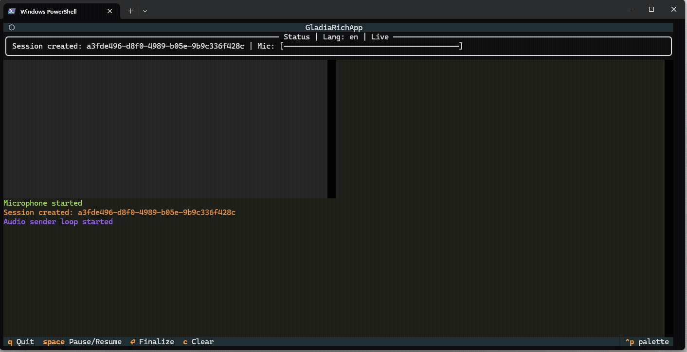

# Rich WebSocket Microphone Demo (Textual)

This example is a rich terminal UI that captures your microphone and streams it to Gladia's WebSocket API for live transcription and translation. It uses Textual/Rich for the UI and sounddevice for low-latency microphone capture.

  

Prereqs

- Python 3.9+
- A Gladia API key set in the environment as GLADIA_API_KEY
- Microphone access enabled on your OS

Controls

- Space: Pause/resume mic streaming
- Enter: Send stop signal (force finalize current segment)
- T: Toggle translation target between en and fr (demo)
- C: Clear transcript/translation panes
- Q or Ctrl+C: Quit

Notes

- Audio is captured at 16 kHz mono, 16-bit (PCM) and streamed in small chunks for low latency.
- The app shows partial transcripts as you speak and final transcripts when segments are finalized.
- Translation events appear in the right pane with the target language.
- If your default input device does not support 16 kHz, sounddevice will resample via PortAudio.

Troubleshooting

- If you see "No API key", set GLADIA_API_KEY and restart.
- If audio capture fails, try selecting a different default input device in your OS.
- On first run, Windows may prompt for microphone permissions.

